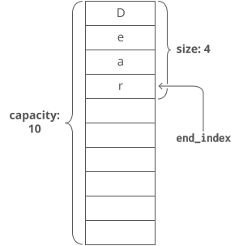
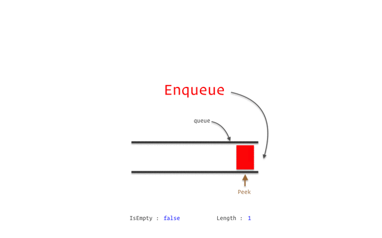
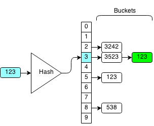
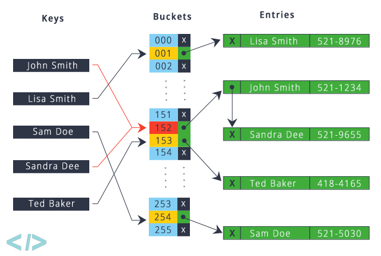
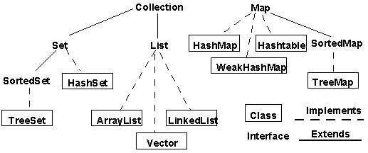

# Lecture 12
#java course#

## Collections

### Data structures

Often when developing programs it is required some information to be stored by the program.

For example if we have to write an online horse raising platform which needs to keep track of:
- Which city on which date has a raise.
- Which are the jockeys in each race.
- How many races has each of the jockeys won, etc...

Such data can be stored or kept in a variety of data structures.

Each data structure has its own specifics, advantages and disadvantages. Choosing the right one
would depend on the type of operations that would need to be performed on the data.

For example, we might often add new horse races in compare with adding new cities.
We might need to search for jockeys that are ordered by the number of won races.

In this lecture we will discuss some fundamental data structures and how they are implemented in Java. 

> ℹ️ For more information about what are data structures watch this
[youtube video](https://www.youtube.com/watch?v=bum_19loj9A).


#### Arrays

Arrays are one of the simplest data structures.
They represent a sequence of elements with a fixed size. 
Each element can be accessed using an index.


- Pros
    - Constant `O(1)` access time to an element using an index.
    - The array can hold multiple elements.
    
- Cons
    - The data structure is static. Meaning we can't add more elements than the size of the array.
    - We need to know the size of the array before we create it.

> The array is often used as a building block for more complicated data structures.

#### List

The List is a data structure that is similar to an array but can be dynamically expanded.

Using a list we do not need to know the initial size of the list. We can add elements to the list, and it will take care
of automatically resizing if needed. 

In Java a `List` is an interface, which has multiple implementations. In this lecture we will have a look at some of them.

##### ArrayList

`ArrayList` is an implementation of the `List` interface. This is a dynamic list, which uses an array under the hoods.
When the underlying array gets full, and a new element needs to be added the `ArrayList` will take care of creating a new
array with larger size, copying the elements from the old array to the new array and add the element.

The array also has a `size` which represents the number of elements that are added.
This is the number **4** in the diagram below. At the same time there is an internal property `capacity`. The capacity
is the actual size of the underlying array. It is not required that the `size` equals to the `capacity`. The difference
between `capacity` and `size` serves as a buffer. When `capacity` equals `size` the underlying array needs to increase in size.

.

> ℹ️ For more information checkout this [youtube video](https://www.youtube.com/watch?v=qTb1sZX74K0).

- Pros
    - We do not need to know the size of the ArrayList before we create it.
    - Fast access to elements using an index.
    - Elements can be added to the end of the array without any overhead.
    
- Cons
    - Adding elements in the beginning or the middle of the array requires the elements on the right to be shifted.
    - When the size reaches the capacity a new array with a larger size needs to be created. 
    The elements from the old array need to be copied into the new array.

**Example**

```java
List<String> myArrayList = new ArrayList<>();

myArrayList.add("foo");
myArrayList.add("bar");
myArrayList.add("zar");
myArrayList.add("var");
myArrayList.add("far");

myArrayList.remove("bar");  // find the element "bar" and remove it
myArrayList.remove(1);      // remove the element located on index 1

for (String myString : myArrayList) {
    System.out.println(myString);
}
```

##### LinkedList


> ℹ️ For more information watch this [youtube video](https://www.youtube.com/watch?v=_jQhALI4ujg).

**Example**

```java
List<String> myLinkedList = new LinkedList<>();

myLinkedList.add("foo");
myLinkedList.add("bar");
myLinkedList.add("zar");
myLinkedList.add("var");
myLinkedList.add("far");

myLinkedList.remove("bar"); // find the element "bar" and remove it
myLinkedList.remove(1);     // remove the element located on index 1

for (String myString : myLinkedList) {
    System.out.println(myString);
}
```

#### Stack


**Example**

```java
Stack<String> myStack = new Stack<>();

myStack.push("foo");
myStack.push("bar");
myStack.push("zar");
myStack.push("var");
myStack.push("far");

String lastElement = myStack.pop(); // remove last pushed element

System.out.println("Last element: " + lastElement);

for (String myString : myStack) {
    System.out.println(myString);
}
```

#### Queue



> ℹ️ For more information watch this [youtube video](https://www.youtube.com/watch?v=wjI1WNcIntg)

**Example**

```java
Queue<String> myQueue = new LinkedList<>();

myQueue.add("foo");
myQueue.add("bar");
myQueue.add("zar");
myQueue.add("var");
myQueue.add("far");

String lastElement = myQueue.poll();    // remove first element

System.out.println("First element: " + lastElement);

for (String myString : myQueue) {
    System.out.println(myString);
}
```

#### Trees 

##### TreeSet


> ℹ️ For a more in depth explanation of what exactly happens when an element is added or removed from an array watch this 
[youtube video](https://www.youtube.com/watch?v=oSWTXtMglKE).

**Example**

```java
TreeSet<String> myTree = new TreeSet<>();

myTree.add("foo");
myTree.add("bar");
myTree.add("zar");
myTree.add("var");
myTree.add("far");

myTree.remove("bar"); // find and remove the elment bar

for (String myString : myTree) {
    System.out.println(myString); // iterate them sorted
}
```

#### Set

##### HashSet



> ℹ️ For more information read [this article](https://www.thecshandbook.com/hash_set)
or watch this [youtube video](https://www.youtube.com/watch?v=WPcKwA5WF7s).

**Example**

```java
Set<Integer> mySet = new HashSet<>();

mySet.put(12);
mySet.put(20);
mySet.put(30);
mySet.put(30);
mySet.put(-15);

mySet.remove(20);

for (Integer number : mySet) {
    System.out.println(number); // iterate them in unspecified order
}
```

#### Hash Tables

##### HashMap



> ℹ️ For a detailed explanation on how Hash Tables work watch [this](https://www.youtube.com/watch?v=MfhjkfocRR0) 
and [this](https://www.youtube.com/watch?v=shs0KM3wKv8) youtube video.

**Example**

```java
Map<String, Integer> myMap = new HashMap<>();

myMap.put("foo", 1);
myMap.put("bar", 3);
myMap.put("zar", -4);
myMap.put("var", 8);
myMap.put("far", 12);

myMap.remove("bar"); // find and remove bar

for (String myKey : myMap.keySet()) { // iterate all keys in unspecified order
    System.out.println(myKey);
}

for (int myValue : myMap.values()) { // iterate all values in unspecified order
    System.out.println(myValue);
}
```

##### Collections vs Maps

Both collections and maps represnet different data structures. 
However, their class hierarchy is separate.



#### Iterators

One common thing between all the data structures that we went through is that they can be iterated. 

Java provides the interface `Iterator` which expresses the ability to iterate over a group of objects.

Here you can see the `Iterator` interface before Java 8.

```java
public interface Iterator<E> {
    
    boolean hasNext();
    
    E next();
     
    void remove();
}
```

> One useful use case of the iterator is when we want to remove elements while iterating.
This can prove difficult to implement with a `for` loop.


All the data structures from the Collection hierarchy have a method `Iterator<E> iterator();` which returns an iterator.
Using it we can loop through the data structure.

The methods of the iterator provide the following functionality.

- `hasNext()` - check if there is a next element

- `next()` - return the next element

- `remove()` - remove the current element (the one on which the iterator is currently located at)

**Example**

```java
List<String> myList = ...;

Iterator<String> myListIterator = myList.iterator();

while (myListIterator.hasNext()) {   
    String currentElement = myListIterator.next();
    
    if ("removeMe".equals(currentElement)) {
       myListIterator.remove(); 
    }
}
```

> Since Java 8 a few more methods have been added to the Iterator interface which are not of grate importance for the scope of this lecture.


#### Compare to

Often when working with a given data type we would need to store the data in a sorted order.
For example if we have a list of numbers we might want to store those numbers in ascending or descending order.
This would allow for faster searches.

Ordering numbers or text is intuitive (text can be order alphabetically). 
Ordering elements that model real life objects is not. For this reason we need a clear definition on how to compare two 
complex objects of the same type.

Let's look at an example where we need to keep an ordered list of people. Before ordering the list we need to define
what will be used to compare two people. We might choose to compare people by age or height or eye color or 
all of the properties.

Here is where the `Comparable` interface comes in. We can use it to give this definition.

```java
public interface Comparable<T> {

    int compareTo(T other);

}
```

The interface has only 1 method `compareTo`, which accepts as an argument the element that will be used to compare against.
The method has an `int` return type. The class implementing this method is required to return **-1**, **0** or **+1** 
depending on if the current item is **less than**, **equal to** or **grater than** respectively.

**Example**

```java
class Person implements Comparable<Person> {
    
    private int age;
    
    public Person(int age) {
        this.age = age;
    }
    
    @Override
    public int compareTo(Person other) {
        if (this.age < other.age){
            return -1;
        }
        
        if (this.age == other.age){
            return 0;
        }
        
        return 1;
    }
}
```


## Tasks

### Task 1

Write a program that accepts unlimited number of user inputs. The user should input floating-point numbers.
The program should stop when the user enters `-1`. Before stopping the program should print all the numbers 
entered by the user in reverse order and also print the smallest of the numbers. 

- Example

```text
Enter number: 32
Enter number: -8
Enter number: 12
Enter number: 0.5
Enter number: -1

Result: 0.5 12.0 -8.0 32.0 
Smallest number: -8.0
```

> Hint: Use `List<Integer> numbers = new ArrayList<>();` to solve the task.

<br/><details><summary><b>Solution</b> 👀</summary> 
<p>

- Task1.java

```java
import java.util.ArrayList;
import java.util.List;
import java.util.Scanner;

public class Task1 {

    private static final double STOP_NUMBER = -1;

    public static void main(String[] args) {
        Scanner scanner = new Scanner(System.in);

        List<Double> myNumbers = new ArrayList<>();

        double min = STOP_NUMBER;

        while (true) {
            System.out.print("Enter number: ");
            double currentNum = scanner.nextDouble();

            if (currentNum == STOP_NUMBER) {
                break;
            }

            if (min == STOP_NUMBER) {
                min = currentNum;
            } else if (min > currentNum) {
                min = currentNum;
            }

            myNumbers.add(currentNum);
        }

        System.out.printf("%nResult: ");
        for (int i = myNumbers.size() - 1; i >= 0; i--) {
            double element = myNumbers.get(i);

            System.out.print(element + " ");
        }

        System.out.printf("%nSmallest number: " + min);
    }
}
```

</p>
</details>

### Task 2

Write a program that prints the unique words entered by a user.
The user can enter single words or whole sentences.
Every program should print a message every time the user enters a word that was previously entered.

The program should stop when the user enters `stop`. Before stopping the program should print all unique words 
entered by the user. The order of printing is not important.

- Example
  
```text
Enter text: football
Enter text: glass
Enter text: pour wine
Enter text: love wine
The word 'wine' is already entered.
Enter text: glass
The word 'glass' is already entered.
Enter text: stop

Unique words: football glass love pour wine
```

> Hint: Use `Set<String> words = new HashSet<>();` to store the unique words.
You can use `String[] words = text.split(" ");` to retrieve all the words in a sentence
 assuming they are separated only by whitespace.

<br/><details><summary><b>Solution</b> 👀</summary> 
<p>

- Task2

```java
import java.util.HashSet;
import java.util.Scanner;
import java.util.Set;

public class Task2 {

    public static void main(String[] args) {
        Scanner scanner = new Scanner(System.in);

        Set<String> uniqueWords = new HashSet<>();

        boolean shouldPromptUser = true;
        while (shouldPromptUser) {

            System.out.print("Enter text:");
            String sentence = scanner.nextLine();

            String[] words = sentence.split(" ");

            for (String currentWord : words) {

                if ("stop".equals(currentWord)) {
                    shouldPromptUser = false;
                    break;
                }

                if (uniqueWords.contains(currentWord)) {
                    System.out.printf("The word '%s' is already entered.%n", currentWord);
                } else {
                    uniqueWords.add(currentWord);
                }
            }
        }

        System.out.printf("%nUnique words: ");
        for (String eachUniqueWord : uniqueWords) {
            System.out.print(eachUniqueWord + " ");
        }
    }
}
``` 

</p>
</details>

### Task 3

Write a program that counts how many times a word has been entered by the user.  
Upon entering `stop` the program should print the most common word and exit.

**Example**

```text
Enter text: cat
Enter text: dog
Enter text: bag
Enter text: dog
Enter text: cat and dog
Enter text: stop

Most frequent word is 'dog' with 3 occurrences.
```

> Use `Map<String, Integer> wordCount = new HashMap<>();` to count the occurrences of each word.
Use the word as key and the count as a value.

<br/><details><summary><b>Solution</b> 👀</summary> 
<p>

```java
import java.util.HashMap;
import java.util.Map;
import java.util.Scanner;

public class Task3 {

    public static void main(String[] args) {

        Scanner scanner = new Scanner(System.in);

        Map<String, Integer> wordCount = new HashMap<>();

        while (true) {
            String word = scanner.nextLine();

            if ("stop".equalsIgnoreCase(word)) {
                break;
            }

            Integer occurrence = wordCount.get(word);

            if (occurrence == null) {
                wordCount.put(word, 1);
            } else {
                wordCount.put(word, occurrence + 1);
            }
        }

        String maxWord = null;
        int max = 0;

        for (Map.Entry<String, Integer> currentEntry : wordCount.entrySet()) {

            String currentWord = currentEntry.getKey();
            int occurrence = currentEntry.getValue();

            if (max < occurrence) {
                maxWord = currentWord;
                max = occurrence;
            }
        }

        System.out.println("Most frequent word is '" + maxWord + "' with " + max + " occurrences.");
    }
}
```

</p>
</details>

### Task 4

Write a program that is capable of interpreting [Reverse Polish Notation](https://en.wikipedia.org/wiki/Reverse_Polish_notation).
RPN is a mathematical notation used by calculators to solve equations.  
The notation is also called postfix notation because the operands are written first followed by the operators.

- Examples

1. `3 + 4` would be `3` `4` `+` (this means the numbers 3 and 4 must be added together)
2. `3 - 20` would be `3` `20` `–` (this means from 3 subtract 20) 
3. `3 – 4 + 5`  would be `3` `4` `–` `5` `+` (this means from 3 subtract 4, the result should be added with 5)
4. `3 – (4 * 5)` would be `3` `4` `5` `*` `–` (this means first multiply 4 and 5 after which
subtract the result from 3, this can also be written as `3` `20` `–` )
5. `(3 – 4) * 5` would be `3` `4` `–` `5` `*`

**Solve examples 1 and 2**  
Assuming that you already have the RPN notation write a program that interprets this notation 
and performs the correct calculations.

<br/><details><summary><b>Solution</b> 👀</summary> 
<p>

```java
import java.util.Arrays;
import java.util.Stack;

public class RPMDemo {
    
    public static void main(String[] args) {

        Stack<String> stack = new Stack<>();

        stack.push("3");
        stack.push("4");
        stack.push("+");

        String item = stack.pop();

        handleItem(stack, item);

        System.out.println(Arrays.toString(stack.toArray()));
    }

    private static void handleItem(Stack<String> stack, String operator) {
        if (isOperator(operator)) {
            String operand2 = stack.pop();
            String operand1 = stack.pop();

            double value1 = Double.parseDouble(operand1);
            double value2 = Double.parseDouble(operand2);

            double result = handleOperator(value1, value2, operator);

            stack.push(Double.toString(result));
        }
    }

    private static double handleOperator(double value1, double value2, String operator) {
        if ("+".equals(operator)) {
            return value1 + value2;
        }
        if ("-".equals(operator)) {
            return value1 - value2;
        }
        if ("*".equals(operator)) {
            return value1 * value2;
        }
        return value1 / value2;
    }

    private static boolean isOperator(String item) {
        return "+".equals(item)
                || "-".equals(item)
                || "*".equals(item)
                || "/".equals(item);
    }
}
```

</p>
</details>

> ℹ️ За повече информация как да се реши тази задача вижте това 
[youtube видео](https://www.youtube.com/watch?v=7ha78yWRDlE).

### Task 5

Напишете програма, която симулира работата на ферма за птици (Chicken Barn).  
🥚 &rarr; 🐤 &rarr; 🐓 &rarr; ⚰️

В една ферма първоначално може да има определен брой кокошки (например 5).  

- Всяка кокошка снася по едно яйце всяка седмица.

- Една кокошка може да снася яйца само ако е м/у 2-8 седмици.

- Яйце което е навършило 2 седмици се излюпва, добавяйки нова кокошка във фермата. 
  Името на излюпената кокошка зависи от името на предишната кокошка.  
  
  **Пример:** 
  ако кокошката снесла яйцето се казва `Chicken1`, то излюпената кокошка може да се казва
  `Chicken1/ChickenX` където `X` е номера на кокошката.

- При навършване на 9 седмици, кокошката умира и се прмахва от фермата.

Програмата трябва да принтира кокошките, които са останали във фермата след определен брой седмици.

**Пояснение**

Една седмица преминава като:
1. Увеличава се възрастта на снесените яйца
2. Излюпват се яйцата, които са навършили необходимата възраст
3. Увеличава се възрастта на кокошките
4. Преахват се кокошките, които са навършили 9 седмици
5. Снасят се яйца от кокошките навършили необходимата възраст
6. Започва следващата седмица

- Пример при 4 начални кокошки съответно на възраст от  4, 5, 6, 7 седмици и общо време за развитие 4 седмици

```text
Chicken{name='Chicken1'}
Chicken{name='Chicken1/Chicken5'}
Chicken{name='Chicken2/Chicken6'}
Chicken{name='Chicken3/Chicken7'}
Chicken{name='Chicken4/Chicken8'}
Chicken{name='Chicken1/Chicken9'}
Chicken{name='Chicken2/Chicken10'}
Chicken{name='Chicken3/Chicken11'}
```

- Пример при 3 начални кокоши съответно на възраст от 3, 4, 5 седмици и общо време за развитие 4 седмици

```text
Chicken{name='Chicken1'}
Chicken{name='Chicken2'}
Chicken{name='Chicken1/Chicken4'}
Chicken{name='Chicken2/Chicken5'}
Chicken{name='Chicken3/Chicken6'}
Chicken{name='Chicken1/Chicken7'}
Chicken{name='Chicken2/Chicken8'}
Chicken{name='Chicken3/Chicken9'}
```

<br/><details><summary><b>Solution</b> 👀</summary> 
<p>

- Main.java

```java
import java.util.ArrayList;
import java.util.List;

public class Main {
    
    public static void main(String[] args) {
        List<Chicken> chickens = new ArrayList<>();

        chickens.add(new Chicken(3)); // добави кокошка на 3 седмици
        chickens.add(new Chicken(4)); // добави кокошка на 4 седмици
        chickens.add(new Chicken(5)); // добави кокошка на 5 седмици

        Barn barn = new Barn(chickens); // създай ферма подавайки кокошките

        List<Chicken> evolvedChickens = barn.evolve(4); // итерирай 4 седмици във фермата

        for (Chicken chicken : evolvedChickens) { // принтирай всички кокошки след 4-те седмици
            System.out.println(chicken);
        }
    }
}
```

- Egg.java

```java
public class Egg {

    private static final int HATCHING_WEEK = 2;

    private String chickenName;
    private int age;

    /**
     * Конструктор, за създаванен на ново яйце.
     *
     * @param chickenName името на кокошката снесла яйцето.
     */
    public Egg(String chickenName) {
        this.chickenName = chickenName;
        age = 0;
    }

    /**
     * Увеличи възрастта на яйцето с 1 седмица.
     */
    public void ageByOneWeek() {
        age++;
    }

    /**
     * Излюпи яйцето, ако е навършило необходимата възраст.
     *
     * @return излюпената кокоша или null, ако яйцето не може да бъде излюпено.
     */
    public Chicken hatch() {

        if (age < HATCHING_WEEK) {
            return null;
        }

        return new Chicken(chickenName);
    }
}
```

- Chicken.java

```java
public class Chicken {

    private static final int DEATH_WEEK = 9;
    private static final int MIN_HATCH_WEEK = 2;
    private static final int MAX_HATCH_WEEK = 8;

    /* Статична променлива, която се използва в името на кокошката.
     * Всеки път, когато се създаде нова кокошка, тази променлива се увеличава с 1.
     */
    private static int ID_SEQUENCE = 1;

    private final String name;

    private int age;

    /**
     * Създай нова кокошка назначавайки и служебно име и подадаената възраст.
     *
     * @param age възрастта на кокошката в седмици.
     */
    public Chicken(int age) {
        this.name = getNextName("");
        this.age = age;
    }

    /**
     * Конструктор създадващ новородена кокошка. Конструкторът приема името на кокошката, която е снесла
     * яйцето. На база това име ще се определи името на тази кокошка.
     *
     * @param chickenName името на кокошката снесла яйцето.
     */
    public Chicken(String chickenName) {
        this.name = getNextName(chickenName + "/");
        this.age = 0;
    }

    /**
     * Метод връщащ името на кокошката съставено от prefix + "Chicken" + ID, където ID е поредния
     * номер на кокошката.
     *
     * @param prefix текст, който да бъде използван пред името на кокошката.
     * @return ново име на кокошка.
     */
    private String getNextName(String prefix) {
        return prefix + "Chicken" + ID_SEQUENCE++;
    }

    /**
     * Този метод проверява дали кокошката е навършила необходимата възраст за да умре.
     *
     * @return true ако е навършила преклонна възраст, false в противен случай.
     */
    public boolean canDie() {
        return age >= DEATH_WEEK;
    }

    /**
     * Този метод връща яйце, ако кокошката е навършила зряла възраст и може да снася яйца.
     * Снесеното яйце има името на кокошката, която го е снесла.
     *
     * @return снесеното яйце или null ако кокошката не може да снася.
     */
    public Egg hatchEgg() {
        if (age < MIN_HATCH_WEEK || age > MAX_HATCH_WEEK) {
            return null;
        }

        return new Egg(name);
    }

    /**
     * Този метод увеличава възрастта на кокошката с една седмица.
     */
    public void ageByOneWeek() {
        this.age++;
    }

    @Override
    public String toString() {
        return "Chicken{" +
                "name='" + name + '\'' +
                '}';
    }
}
```

- Barn.java

```java
import java.util.ArrayList;
import java.util.Iterator;
import java.util.List;

public class Barn {

    private List<Chicken> chickens;
    private List<Egg> eggs;

    /**
     * Конструктор, който инициализира фермата с подадените през него кокошки.
     * Когато се създаде нова ферма, в нея няма яйца.
     *
     * @param chickens първоначалните кокошки във фермата.
     */
    public Barn(List<Chicken> chickens) {
        this.chickens = chickens;
        this.eggs = new ArrayList<>();
    }

    /**
     * Този метод еволюира фермата с определен брой седмици.
     *
     * @param weeks броя седмици, с които да бъде еволюирана фермата.
     * @return връща списъкът с кокошки след еволюцията.
     */
    public List<Chicken> evolve(int weeks) {

        for (int week = 0; week < weeks; week++) {

            hatchEggs();

            growChickens();
        }

        return chickens;
    }

    /**
     * Този метод репрезентира, какво се случва през една седмица с яйцата.
     * Методът обикаля всички налични яйца, увеличава им възрастта с 1 седмица,
     * излюпва яйцата, които са годни и добавя излюпените кокошки в списъка с кокошки.
     */
    private void hatchEggs() {
        Iterator<Egg> iterator = eggs.iterator();

        while (iterator.hasNext()) {

            Egg currentEgg = iterator.next();

            currentEgg.ageByOneWeek();
            Chicken newChicken = currentEgg.hatch();

            if (newChicken != null) {
                chickens.add(newChicken);

                iterator.remove();
            }

        }
    }

    /**
     * Този метод репрезентира, какво се случва през една седмица с кокошките.
     * Методът обикаля всички налични кокошки, увеличава им възрастта с 1 седмица
     * Премахва кокошките на преклонна възраст и снася яйца използвайки кокошките на зряла възраст,
     * като добавя излюпените яйца в списъка с яйца..
     */
    private void growChickens() {
        Iterator<Chicken> iterator = chickens.iterator();

        while (iterator.hasNext()) {
            Chicken currentChicken = iterator.next();

            currentChicken.ageByOneWeek();

            if (currentChicken.canDie()) {
                iterator.remove();
            }

            Egg egg = currentChicken.hatchEgg();
            if (egg != null) {
                eggs.add(egg);
            }
        }

    }
}
```

</p>
</details>
