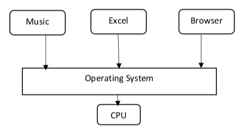
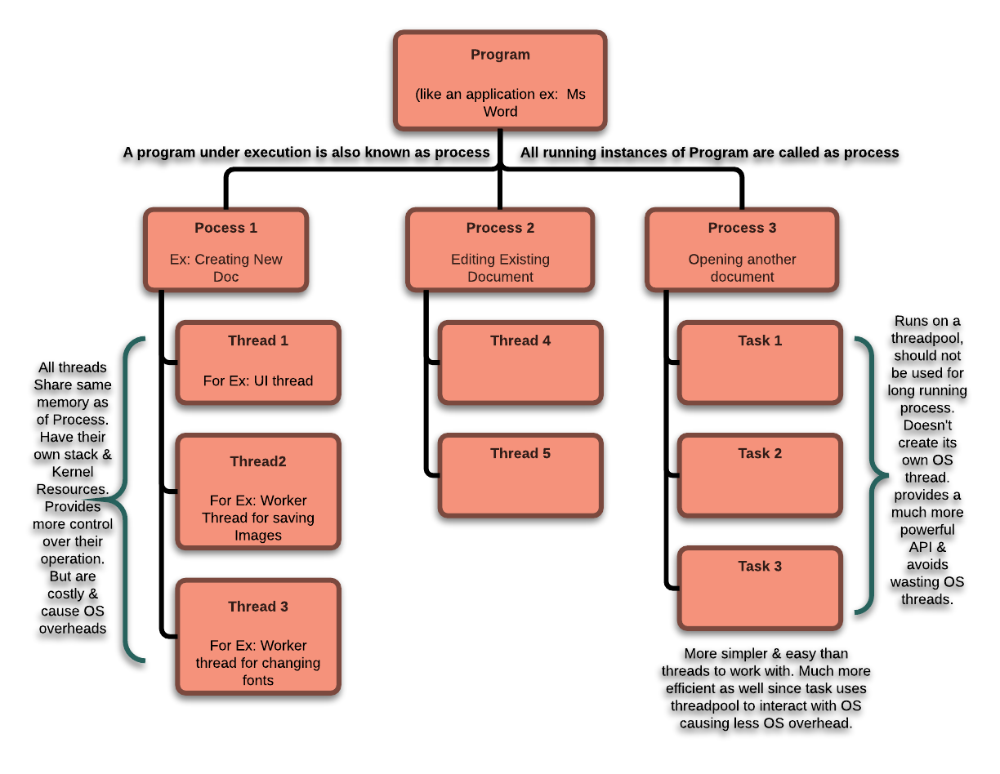
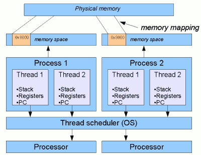
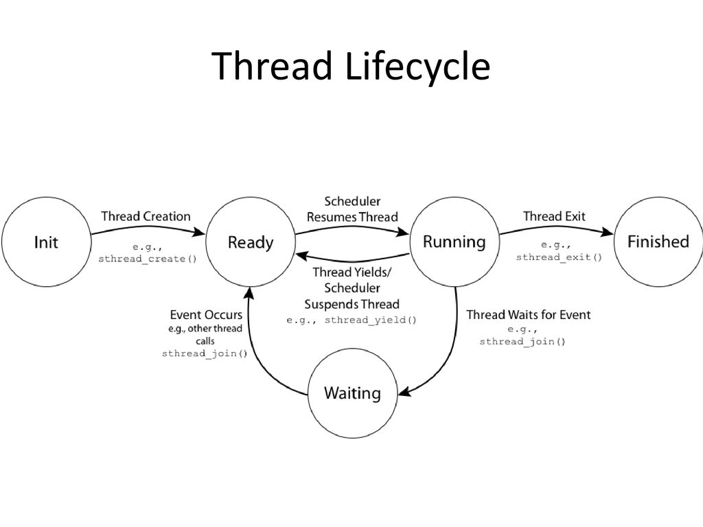

## Multithreading and Concurrency Fundamentals


### Concurrency

Nowadays we use computers to do multiple things at once. We browse the web while listening to music, write text documents
while downloading files etc...

If we have a single core CPU we only get to execute a single instruction at any given point in time. At the same time we are able
to run multiple programs and have the feeling that everything is happening at once. This would not have been possible 
if the system was not **concurrent**.  
To have a system that is concurrent means that the system is capable of doing multiple things (not necessarily at once).



### Context Switching

What ends up happening is that the CPU gets a small portion of time to execute instructions of a given task, after which 
it moves on to executing instructions on the next task and so on. This is called **context switching**. 
Thanks to context switching the system is capable of multitasking. 
This creates the illusion that multiple tasks (processes) are executed at the same time.

However, context switching has some overhead. If the CPU is to be switched to work on another task the state of the current 
task needs to be saved, and the state of the next task loaded. This allows for resuming the previous task when the time comes.    
The task's state is actually the **context**. It consists of the CPU's registers and program counter at any point in time.  

You can see this illustrated in the diagram bellow. 


> ℹ️ For mor details on how a computer executes instructions watch this [youtube video](https://www.youtube.com/watch?v=XM4lGflQFvA).

### Parallelism

Modern computers include CPUs that have multiple cores. This allows tasks to be executed simultaneously (in parallel).

Often the terms concurrency and parallelism get mixed and sometimes used interchangeable. However, it is important
to point out that there is a subtle difference between the two.

**Concurrency is about dealing with lots of things at once. Parallelism is about doing lots of things at once.**

A well-designed concurrent system can have components that can be executed in parallel.  


It also makes sense to mention here that adding multiple CPU cores can speedup the execution of the program however there
is a theoretical limit that can be reached after which the number of cores does not matter. This is also known as the
[Amdahl's Law](https://en.wikipedia.org/wiki/Amdahl%27s_law).

**Mothers giving birth are a good example.**  
A pregnant woman can give birth to a child in 9 months. Adding 8 more women won't result in a child being born in 1 month.
It can result in 9 children being born but the minimum time required is 9 months. If a speedup is required the process of 
giving birth needs to be broken down into something that can be further parallelized.

## Threads

Up until now we have talked about executing tasks on the CPU. It is important to note that there is a difference between
a **process**, a **thread**, and a **task**.

To put it simply a process is a program that is being executed. A process can have multiple threads and multiple threads can be reused
in order to execute tasks on them. Sometimes you can see these terms used interchangeably but in most cases they are used
to differentiate between something that is doing the work and something that needs to get done.

The diagram below tries to illustrate this.



In principle the thread in a single threaded process is the actual process. 
However, there are cases where a process (program) might need to do multiple things at once. 
This is where threads actually come into play, and we would need more than on of them.

User Interfaces (UI) are always a good example for this.
When you open a web browser and type in a URL and hit enter two things happen. 
A request for the web page is made, and the UI continues to be responsive. 
Those things can easily be done on two separate threads. 
If they were executed on a single thread then we wouldn't be able to click anything on the UI until the web 
page finishes loading. 

You can think of processes and threads as units that can be used to get work done. 
Tasks on the other hand can be though of as the actual work. We feed or schedule tasks on the threads.

It is important to note that threads share the same memory (address space) within a process 
while processes do not share memory between them self.

This is one of the reasons context switching between processes includes more overhead than context switching between threads.  
For more details checkout this [article](https://www.geeksforgeeks.org/difference-between-thread-context-switch-and-process-context-switch/).

### The thread scheduling & pooling

There are generally more threads than CPUs. Part of a multithreaded system is therefore a thread scheduler, 
responsible for sharing out the available CPUs in some way among the competing threads.



Different OS's have different schedulers and can implement scheduling using different algorithms. There are also different
approaches for scheduling as **cooperative**, **preemptive** and a mix of the two.

The diagram below illustrates a thread's lifecycle.



On the other hand a single process can spawn multiple threads. This requires system calls to the OS which in
turn requires allocation of more resources. Each thread has its own stack, set of registers and program counter.  
Programs often try to minimize system calls and unnecessary memory allocation. Thus threads end up being reused.  
This is called **Thread Pooling**. 
Using this technique we don't eliminate the problem of having more things to do than available threads. 
Rather, we reduce the overhead created from spawning new ones. At the same time we shouldn't spawn threads carelessly,
as more threads introduce more overhead for scheduling and memory management. 
So having more things to do and not enough workers to do it enforces the need of a Task Queue which can serve as a buffer.


#### Additional Learning resources

If you wan a more in depth explanation on thread scheduling checkout:
 - [How Threads Work: more details](https://www.javamex.com/tutorials/threads/how_threads_work.shtml) 
 - [Cooperative vs. Preemptive: a quest to maximize concurrency power](https://medium.com/traveloka-engineering/cooperative-vs-preemptive-a-quest-to-maximize-concurrency-power-3b10c5a920fe)
 - [Threads](https://www.cs.uic.edu/~jbell/CourseNotes/OperatingSystems/4_Threads.html)
 - [Basic Thread Management](https://pages.mtu.edu/~shene/NSF-3/e-Book/FUNDAMENTALS/thread-management.html)
 - [Concurrency and Multithreading - Introduction (video)](https://www.youtube.com/watch?v=mTGdtC9f4EU)

## Java Threads

Java exposes a set of tools that allow for developing multithreaded applications.
When a Java application is started its `main()` method gets executed from the **main thread** that is created by the JVM.
That thread can spawn multiple other threads. Threads have a parent-child relationship so that when the parent thread
terminates all the child threads terminate as well.

In Java, we can create a thread by creating an instance of the class `Thread` which can also be extended.

```java
Thread thread = new Thread();
thread.start();
```

It is pointless to create threads without delegating any work to them.
There are a few ways we can do this.

- Extending a thread

```java
class GreetingThread extends Thread {

    @Override
    public void run() {
        System.out.println("Hello Multi Threading");
    }
}

GreetingThread thread = new GreetingThread()
thread.start();
```

- Implementing the `Runnable` interface

```java
class Greeting implements Runnable {
    @Override
    public void run() {
        System.out.println("Hello Multi Threading");
    }
}

Thread thread = new Thread(new Greeting());
thread.start();
```

> A common mistake is to invoke the `run` method of the thread instead of `start`. By invoking `start` the code
will get executed on the new thread. If you instead invoke `run` the code will still 
get executed but on the current thread.

#### Example single thread vs multiple threads

The code below does 10 iterations while sleeping for 1 second in each.  
In total the execution time takes around 10 seconds because the same thread is put to sleep for 1 second.

```java
for (int i = 0; i < 10; i++) {
    try {
        System.out.println("Sleeping for 1000 ms");
        Thread.sleep(1000);
    } catch (InterruptedException e) {
        e.printStackTrace();
    }
}
```

The code below performs the sleep inside a separate thread. 
In total the execution time is around 1 second.

```java
for (int i = 0; i < 10; i++) {
    new Thread(new Sleeper()).start();
}

...

class Sleeper implements Runnable {
    @Override
    public void run() {
        try {
            System.out.println("Sleeping for 1000 ms");
            Thread.sleep(1000);
        } catch (InterruptedException e) {
            e.printStackTrace();
        }
    }
}
```


### Synchronization

Let us look at an example that uses multiple threads to increment a shared counter.

```java
public class Main {
    static int counter = 0;

    public static void main(String[] args) {
        for (int j = 0; j < 1000; j++) {
            new Thread(new Runnable() {
                @Override
                public void run() {
                    counter++;
                }
            }).start();
        }

        System.out.println(counter);
    }
}
```
> The code starts 1000 threads that increment the value of `counter`.

If you run this code several times you might notice that the end result is not always 1000.
This is due to the fact that `counter++` is not an atomic operation. By an atomic operation we mean
an operation that guarantees that there will be no interference by other threadouo/processes while it is being performed.  
Usually those operations involve reading and writing from memory, disk, network etc...

Let us examine more closely `counter++`. In order for this operation to be performed we need to:
1. read the value of counter from memory
2. increment the value
3. write the value back to memory

`counter++` does not guarantee that while thread **A** performs the operation another thread **B**
 can't also step in before thread **A** finishes. You can see this illustrated in the diagram below.
 


In order to fix this problem we need to guarantee a **[happens before relationship](https://en.wikipedia.org/wiki/Happened-before)**.
Or in other words we must guarantee that the writing of thread **A** happens before the reading of thread **B**.  
You can see this illustrated in the diagram below.


- synchronized & synchronization blocks
- await && notify
- monitors
- volatile
- atomicity
- semaphore
- reentrant lock
- immutability
- race conditions
- happens before relationship

#### Additional Learning resources

 - [Creating and Starting Java Threads](http://tutorials.jenkov.com/java-concurrency/creating-and-starting-threads.html)
