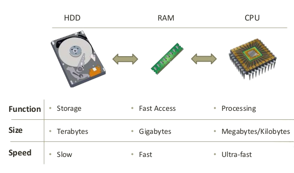
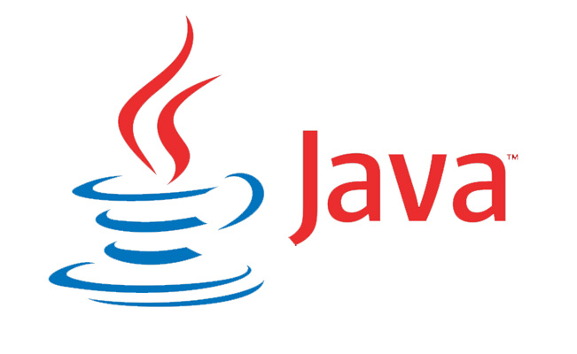

# Lecture 1
#java course#

## Introduction

### How does the human brain work?

The human brain is divided into areas where each area has a concrete purpose.  
For example the [prefrontal cortex][prefrontal-cortex] is responsible for focusing on tasks 
and serves as a short term memory.  
Another area called [hippocampus][hippocampus] is in charge of memories and 
serves as a long term memory.  
The [temporal lobe][temporal-lobe] is involved in processing sensory input. 
We use the temporal lobe along with the *prefrontal cortex* and other areas of the brain to solve math problems.


> Did you know that the *[amygdala][amygdala]* is responsible for regulating emotions, fear, anxiety?  
[Alex Honnold][alex-honnold] he is considered the most fearless free solo climber. He owns a big part of his success  
to his malfunctioning *amygdala*.  
The *amygdala* is also often responsible for the fear in students wanting to ask a question.

[prefrontal-cortex]: https://en.wikipedia.org/wiki/Prefrontal_cortex
[hippocampus]: https://en.wikipedia.org/wiki/Hippocampus
[temporal-lobe]: https://en.wikipedia.org/wiki/Temporal_lobe
[amygdala]: https://en.wikipedia.org/wiki/Amygdala
[alex-honnold]: http://nautil.us/issue/39/sport/the-strange-brain-of-the-worlds-greatest-solo-climber

### How does a computer work?

Similar to a [human brain](#how-does-the-human-brain-work) the computer also has dedicated parts responsible for memory 
and computation. It also has several memory units. *Short term (RAM)* and *long term (HDD)* memory.
The computations or the so called instructions are processed by the *processor (CPU)*.



> When we write programs we will save them on *HDD*, when we run the program 
it will be loaded in *RAM* and will be processed by the *CPU*.

## What is Java?

Java is a high level programming language. This means that we as programmers don't have to think about details like 
what is the CPU of the machine that the program will run on, what is the operating system etc...



> [James Gosling][james-gosling] created Java in 1995.  
Java is actually an island on which coffee trees are planted.

[james-gosling]: http://www.computinghistory.org.uk/det/1793/James-Gosling/


### What is Java composed of?

The programming language Java can be thought of as a collection of tools/technologies.

- JDK (Java Development Kit) - the JDK provides the necessary tools for programmers to write Java programs 
which can then be ran via the JRE and JVM.

- JRE (Java Runtime Environment) - the JRE is a collection of libraries which will be used during the execution of the program. 
The JRE also includes the JVM.

- JVM (Java Virtual Machine) - the JVM is the component that executes the program.


### How does a Java program get executed?

The programs that we write are nothing more than text files with a `.java` extension. 
In order for these files to be executed by the computer they first need to be translated into a low level language the processor understands.
This happens in several steps.

1. The text files `.java` are translated (compiled) by the `compiler` into `bytecode`. The resulting `bytecode` translations are actually files with a `.class` extension.
2. The `.class` files are loaded by the `JVM` for execution.
3. `JVM` executes `bytecode` by translating (interpreting) it into instructions that are understandable by the specific operating system and underlying CPU.


#### What else do se need to know about Java?

###### Java is a multi platform system
This means that a program can be executed on different operating systems like Windows, Linux, Mac etc...
Also known as **Write once run anywhere**.

###### Do I need a JDK in order to run a Java program
It is not required to have `JDK` installed on a computer in order to run a Java program. 
The program can be written and compiled on a computer that has a `JDK` and can 
be executed on another that has only `JRE` installed.

###### Java is an object oriented language
This means that the language has the ability to model objects from the real world. (We will touch on this in the next lectures).

###### Java is a typed language
This means that everything that can be modeled by the language has a concrete type.
Some examples are: numbers, text, dates etc...

## Primitive types

Java already has data types that model basic concepts. An example for such **primitive** types are:
*symbol*, *hole number*, *floating-point number* etc...  

Primitive types are in the core of the language. They are used and will be used by us to build more complex data types.
One such example is *text*, it is composed out of many *symbols*.

### Number types

Numbers can be divided in two main categories. Hole numbers `1`, `-5`, `367` and
floating-point numbers `3.14159`, `2.718`, `-332.97`. Each of the categories can be further divided into 
sub categories where each sub category corresponds to a number with a specific size and precision.

- Numbers

    - Whole numbers
        - `byte`  8 bit = -128…127
        - `short` 16 bit = -32 768….32 767
        - `int` 32 bit = -2 147 483 648…2 147 483 647
        - `long` 64 bit = -2^63…2^63 - 1 
        
    - Decimal numbers (floating-point numbers)
        - `float` 32 bit = -3.4E+38…3.4E+38
        - `double` 64 bit = -1.7E+308…1.7E+308
        
### Symbol types

- Symbol

    - `char` 16 bit unicode character = *a*,    *$*,    *4* 

### Boolean types

- Boolean
    - `boolean` = true/false


## Variables

Using different data types we can create **variables**.
Each variable has a **type**, **name** and **value**.
You can imagine variables as boxes with different shapes. The shape of the box is the **type**.
The content of the box is the **value**. The hole box itself is the **variable**, because the 
contents of the box can change.
Also imagine if we have many boxes with a similar shape. In order to be able to differentiate between them
we would need to label each of the boxes. This would correspond to the **name** of the variable.


- Example

    ```java
    int year = 2019;
    
    double pi = 3.14;

    boolean isMale = true;
  
    char dollar = '$';
    ```
    
#### Arithmetic operators

- `+` —  addition
- `-` — subtraction
- `*` — multiplication
- `/` — division
- `%` — modulo

#### Logical operators

- `!`  - logical NOT
- `&&` — logical AND
- `||` — logical OR

#### Comparison operators

- `==` - equal
- `!=` - not equal 
- `>` - greater than
- `>=` - greater than or equal
- `<` - less than
- `>=` - less than or equal

## Hello World

Our first Java program will print on the console `Hello World`. 
The aim of the task is to get familiar with the language syntax.

```java
public class Main {
    
    public static void main(String[] args) {
        System.out.println("Hello World");
    }
}
```

> Did you know that the first *[Hello World][hello-world]* program is written 
back in 1972 using the programming language [B][b-language].

[hello-world]: https://en.wikipedia.org/wiki/%22Hello,_World!%22_program
[b-language]: https://en.wikipedia.org/wiki/B_(programming_language)

## Hello ...

The aim of our second task is to write a program which greets with whatever is entered by the user.
Example: if the user enters `Alise` the program should print `Hello Alise`.

```java
import java.util.Scanner; // we mention what are we going to use to get user input

public class Main2 {

    public static void main(String[] args) {
        Scanner myScanner = new Scanner(System.in); // we create the thing that we will use to get user input and name it myScanner

        String input = myScanner.nextLine(); // we use the variable myScanner to take whatever the user enters on the keyboard and write it into a variable called input

        System.out.println("Hello " + input); // we print Hello along with what the user has entered
    }
}
```

> The program is written in a second file with called `Main2`.  
When the program starts enter a name on the keyboard and press enter.

ℹ️ For more info on the different data types you can watch this [youtube video](https://www.youtube.com/watch?v=TBWX97e1E9g&list=PLE7E8B7F4856C9B19)
and this [youtube video](https://www.youtube.com/watch?v=yYN8u90MKCg&list=PLE7E8B7F4856C9B19&index=2).